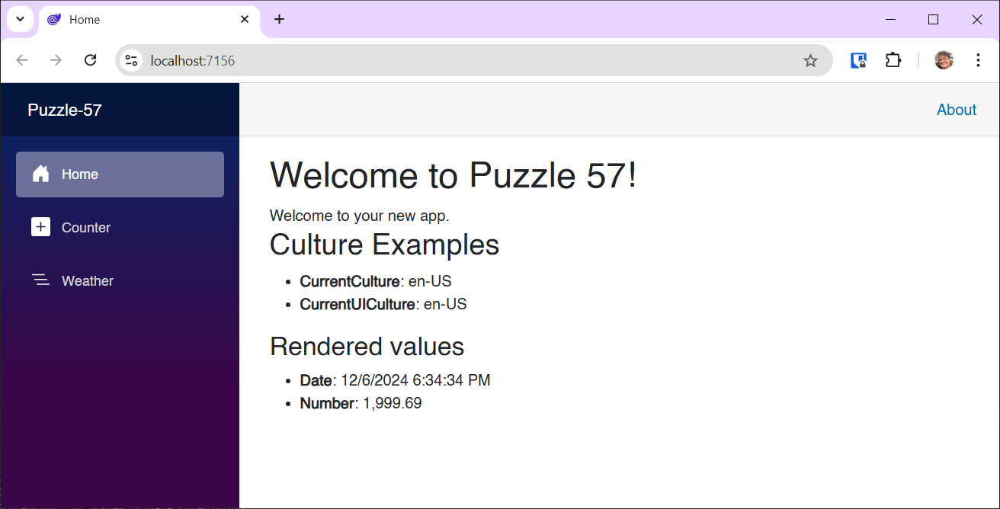

# Blazor Puzzle #57

## Loony Localizations

YouTube Video: https://youtu.be/HuRoKQcajvU

Blazor Puzzle Home Page: https://blazorpuzzle.com

### The Challenge:

We want to start building better Blazor websites that allow our international friends who speak languages other than English to participate.  In this example, we followed the instructions to add Localization capabilities to the InteractiveServer website.  The culture gets properly detected, and updates the section at the bottom, but for some reason the translation in the greeting line does not get applied.

What's the problem in our project?

### The Solution:

Namespaces can't include dashes. So, Visual Studio converts them to an underscore. Check out line 2 of *Program.cs*:

```c#
using Puzzle_57.Components;
```

However, there seems to be a bug in Visual Studio where the namespace does not get converted on this line in the *.csproj* file:

```xml
<RootNamespace>Puzzle-57</RootNamespace>
```

Therefore, the localization engine can't find what it needs to do the translation. Cue the sad trombones!

Change the dash to an underscore and you'll see that it works!



Boom!
